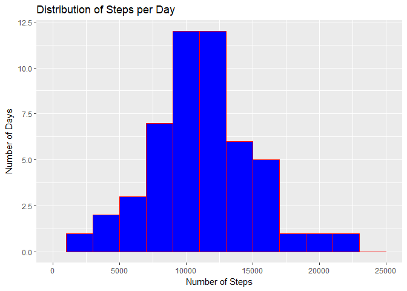
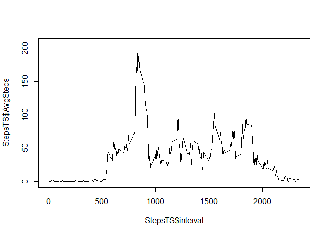
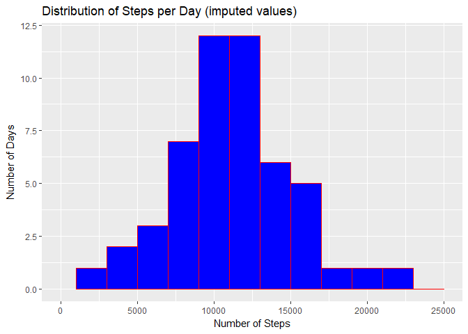
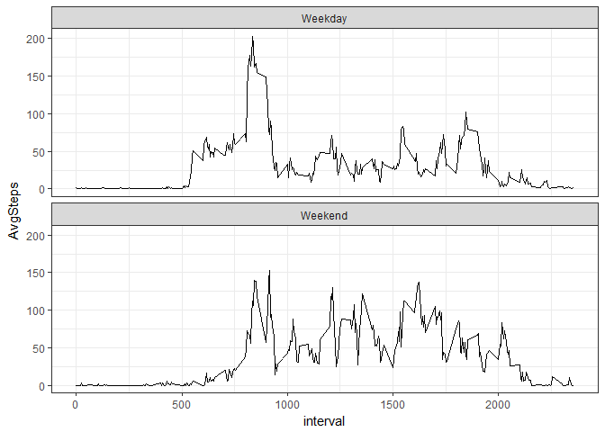

## Loading and preprocessing the data


```r
act <- read.csv('activity.csv', stringsAsFactors = FALSE)
head(act)
```

```
##   steps       date interval
## 1    NA 2012-10-01        0
## 2    NA 2012-10-01        5
## 3    NA 2012-10-01       10
## 4    NA 2012-10-01       15
## 5    NA 2012-10-01       20
## 6    NA 2012-10-01       25
```

```r
act$date <- as.Date(act$date, "%Y-%m-%d")
head(act)
```

```
##   steps       date interval
## 1    NA 2012-10-01        0
## 2    NA 2012-10-01        5
## 3    NA 2012-10-01       10
## 4    NA 2012-10-01       15
## 5    NA 2012-10-01       20
## 6    NA 2012-10-01       25
```

## What is mean total number of steps taken per day?

```r
require(dplyr)
require(ggplot2)
```

```r
StepsByDate <- data.frame(act %>% 
                            group_by(date) %>% 
                            summarise(TotalSteps = sum(steps, na.rm = TRUE)) )
head(StepsByDate)
```

```
##         date TotalSteps
## 1 2012-10-01          0
## 2 2012-10-02        126
## 3 2012-10-03      11352
## 4 2012-10-04      12116
## 5 2012-10-05      13294
## 6 2012-10-06      15420
```

```r
qplot(StepsByDate$TotalSteps, geom="histogram",
      binwidth = 2000,
      main = "Distribution of Steps per Day",
      xlab = "Number of Steps",
      ylab = "Number of Days",
      xlim = c(0,25000),
      fill = I("blue"),
      col = I("red"))
```

<!-- -->

```r
paste('Mean Steps per Day: ', mean(StepsByDate$TotalSteps, na.rm = TRUE))
```

```
## [1] "Mean Steps per Day:  9354.22950819672"
```

```r
paste('Median Steps per Day: ', median(StepsByDate$TotalSteps, na.rm = TRUE))
```

```
## [1] "Median Steps per Day:  10395"
```


## What is the average daily activity pattern?

```r
StepsTS <- data.frame(act %>% 
                            group_by(interval) %>% 
                            summarise(AvgSteps = mean(steps, na.rm = TRUE)) )

head(StepsTS)
```

```
##   interval  AvgSteps
## 1        0 1.7169811
## 2        5 0.3396226
## 3       10 0.1320755
## 4       15 0.1509434
## 5       20 0.0754717
## 6       25 2.0943396
```

```r
plot(StepsTS$AvgSteps ~ StepsTS$interval, type = "l")
```

<!-- -->

```r
paste("Interval with max steps: ", 
      StepsTS[which(StepsTS$AvgSteps == max(StepsTS$AvgSteps)), "interval"])
```

```
## [1] "Interval with max steps:  835"
```


## Imputing missing values

```r
paste('Number of rows in Activity w/ missing values: ', sum(!complete.cases(act)))
```

```
## [1] "Number of rows in Activity w/ missing values:  2304"
```

```r
naToAvg <- function(x) replace(x, is.na(x), median(x, na.rm = TRUE))

act_fixed <- replace(act, TRUE, lapply(act, naToAvg))
paste('Number of rows in Activity_Fixed w/ missing values: ', sum(!complete.cases(act_fixed)))
```

```
## [1] "Number of rows in Activity_Fixed w/ missing values:  0"
```

```r
StepsByDate_New <- data.frame(act_fixed %>% 
                            group_by(date) %>% 
                            summarise(TotalSteps = sum(steps, na.rm = TRUE)) )
qplot(StepsByDate_New$TotalSteps, geom="histogram",
      binwidth = 2000,
      main = "Distribution of Steps per Day (imputed values)",
      xlab = "Number of Steps",
      ylab = "Number of Days",
      xlim = c(0,25000),
      fill = I("blue"),
      col = I("red"))
```

<!-- -->

```r
paste('Mean Steps per Day (w/ imputing): ', mean(StepsByDate_New$TotalSteps))
```

```
## [1] "Mean Steps per Day (w/ imputing):  9354.22950819672"
```

```r
paste('Median Steps per Day (w/ imputing): ', median(StepsByDate_New$TotalSteps))
```

```
## [1] "Median Steps per Day (w/ imputing):  10395"
```

```r
paste('Note: Using imputing, mean changes by: ', 
mean(StepsByDate_New$TotalSteps) - mean(StepsByDate$TotalSteps, na.rm = TRUE))
```

```
## [1] "Note: Using imputing, mean changes by:  0"
```

```r
paste('Note: Using imputing, median changes by: ', 
median(StepsByDate_New$TotalSteps) - median(StepsByDate$TotalSteps, na.rm = TRUE))
```

```
## [1] "Note: Using imputing, median changes by:  0"
```


## Are there differences in activity patterns between weekdays and weekends?


```r
act_fixed$WeekDay <- ifelse( weekdays(act_fixed$date) == 'Saturday' |
                                 weekdays(act_fixed$date) == 'Sunday', 'Weekend', 'Weekday')


Steps_Day <- data.frame(act_fixed %>% 
                            group_by(interval, WeekDay) %>% 
                            summarise(AvgSteps = mean(steps, na.rm = TRUE)) )

ggplot(Steps_Day, aes(x = interval, y = AvgSteps)) + 
  geom_line() + 
  facet_wrap(~WeekDay, ncol = 1) + theme_bw()
```

<!-- -->
